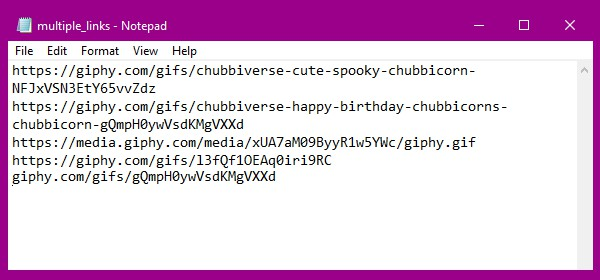

### giphy to mp4
- `converts giphy.com gifs to mp4 video files and downloads them.`

### instructions
#### for one gif
- `enter/paste giphy url`
- `press ENTER and wait for the video to download`
- `check the mp4s folder for the video`
#### for mass gifs
- `put all the urls in the mutliple_links.txt file (seperate these with a new line, see image)`
  
</img>
- `save the file`
- `start the program`
- `type 'f' and press enter (case insensitive)`
- `wait for the videos to download`
- `check the mp4s folder for the videos`

#### credits
- `all credits go to dennzlak ( me )`
